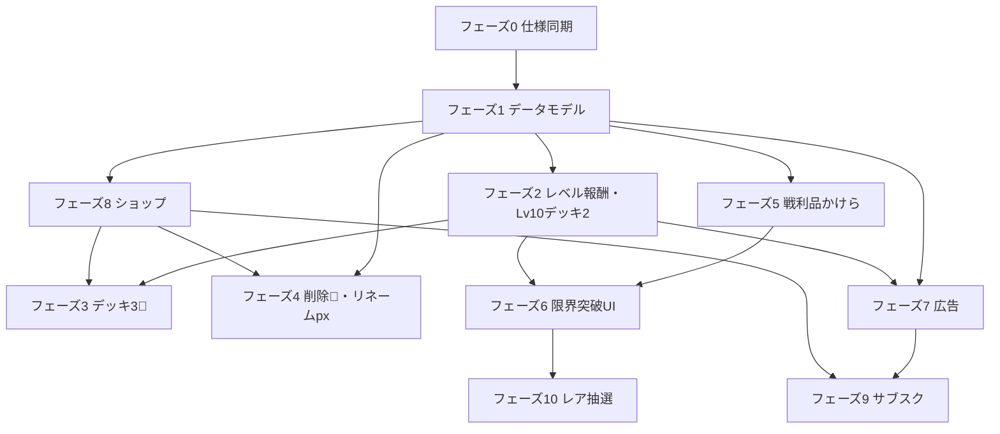

# 経済・課金・広告 — 実装ロードマップ

**作成日**: 2026-06-14  
**最終更新**: 2026-06-27（監査反映 — 仮ロスト廃止・schema 整理・フェーズ10完了）  
**ステータス**: 設計合意（議論ベース）・段階実装の指針  
**関連**: [ECONOMY_SPEC.md](./ECONOMY_SPEC.md)（旧 §10 ポーション/溶解モデルは本書で置き換え）、[PROTOTYPE_DEVELOPMENT_SPEC.md](./PROTOTYPE_DEVELOPMENT_SPEC.md) §5.9

本書は、2026-06 時点の設計議論を **実装順序つき** に整理したロードマップである。  
`ECONOMY_SPEC.md` の全面改訂は **フェーズ 0** で行い、以降のフェーズは本書を正とする。

---

## 1. 設計の確定事項（サマリ）

### 1.1 通貨・資源の三分法

| 表示 | 内部名（案） | 入手 | 主な用途 |
|------|--------------|------|----------|
| 無償 | `freePixels` | バトル、レベルアップ、**カード削除返還**、勝利2倍広告、**属性リタッチ** | **復活**、**護符購入（px）**、**汎用かけら購入**、**リネーム**、編集時キャンバス拡大 |
| 💎 ジュエル | `jewels` | 課金、**毎レベル 30**、サブスク | 削除・**属性セレクト**・デッキ3以降・限界突破レア昇格・創作拡張の **その場消費** |
| 属性かけら | `limitBreakShards[attribute]` | **勝利時の戦利品選択** | 同一属性カードの限界突破（**N=10 / R=15 / SR・UR=20**） |
| 汎用かけら | `limitBreakUniversal` | **L≡4 (mod 5), L≥5**（9, 14, 19…）・**ショップ（px）** | 任意属性のかけらとして消費（属性かけらと同価値） |
| 護符 | `inventory.talisman` | **Lv5 到達（初回 ×1）**、**Lv20,30,40,50**、**ショップ（px）**、サブスク | ロスト1回免れ（装備消費） |

**採用しないもの（旧仕様から廃止）**

- 復活ポーション・溶解リキッド・リネームチケット・デッキ解放キー等の **中間 consumable 商品名**
- 有償ピクセル（ジュエルに統合）
- Lv10 の汎用かけら配布（→ デッキ2解放に差し替え）

**UI 原則**

- 💎 が必要な操作には **💎 アイコン＋数値** をボタン/確認に表示
- px 操作には px アイコンのみ
- 限界突破は **マイデッキ詳細** にのみ表示（§16.9）。所持数は **所持品タブ**

### 1.2 復活・削除（プロトタイプ現行値）

| 操作 | 支払い | 備考 |
|------|--------|------|
| **復活** | px（カードごと） | `floor(塗り×3×レア倍率×★倍率)`。塗り0は最低1px。**上限3回**（`REVIVE_CAP`） |
| ~~**降格復活**~~ | — | **廃止**（2026-06-20・コード削除済 2026-06-27） |
| **思い出アルバムに保存** | **無償** | デッキから除去→閲覧専用アーカイブ。返還なし |
| **思い出アルバム行解放** | **💎 1,000 / 行** | +5枠。上限なし |
| **アルバムから削除** | **💎 5** | px・かけら返還（デッキ削除と同式） |
| **カード削除** | **💎 5** | active / lost **共通** |
| **削除返還** | px ＋ 属性かけら | px は `calcGraveyardPixelReward`（勝利戦利品と同式）。かけら N=1/R=2/SR=3 |

レア・★倍率は `LOST_WEIGHT_RARITY` / `LOST_WEIGHT_STARS` を流用（`economy.ts`）。

### 1.3 デッキ解放

| スロット | 条件 |
|----------|------|
| デッキ1 | 初期（`DECK_SLOT_INITIAL_UNLOCKED = 1`） |
| デッキ2 | **ユーザーレベル ≥ 10**（到達時に自動解放＋告知） |
| デッキ3〜5 | **💎 1,000 消費**（Lv10 未到達では不可。順番に解放） |

### 1.4 レベルアップ報酬（5n+m の変更点）

| 条件 | 報酬 |
|------|------|
| **毎レベル** | 無償 px（**300**）＋ **💎 30** |
| L ≡ 4 (mod 5), L ≥ 5 | **汎用かけら ×20**（9, 14, 19, 24, 29, 34, 39, 44, 49） |
| **Lv10** | **デッキ2 解放**（汎用かけらは **配布しない**） |
| **Lv20, 30, 40, 50** | **護符 ×1**（汎用かけらの代わり） |
| その他 mod 5 | 色・属性・ツール・キャンバス（現行 §5.9 どおり） |

- **経済設計意図**: 創作系は **px 統一**（レベルアップ **300** / 属性リタッチ **300** / リネーム **200**）。💎 は削除・セレクト・デッキ解放等の**意思決定コスト**。無課金の必須💎は主に**カード削除**（5💎/回）。属性セレクト（100💎/回）が主な💎シンク。デッキ3以降・追加色・ツール早期解放は課金/ヘビー向け。

### 1.4b 創作系 px コスト（確定・2026-06-20）

| 操作 | コスト | 備考 |
|------|--------|------|
| レベルアップ | **100 px** / 回 | `LEVEL_UP_PIXEL_REWARD` |
| レベルアップ💎 | **10** / 回 | `JEWELS_PER_LEVEL` |
| バトル勝利 px | **×0.5** | `BATTLE_VICTORY_PX_MULTIPLIER` |
| 属性リタッチ | **300 px** / 回 | 属性ランダム変更（§8.4） |
| リネーム | **200 px** / 回 | 名前変更保存時。属性は不変（§8.2） |
| キャンバス拡大 | **新²−旧²** px | 編集保存時（§8.2） |

### 1.5 限界突破

| 項目 | 内容 |
|------|------|
| 実行コスト | **かけら合計**（専用＋汎用、**1:1**・内訳選択可）（px・💎不可）。**N=10 / R=15 / SR・UR=20** |
| 戦利品 | 相手墓地1枚選択時: **px（現行式）＋ 選択カード属性のかけら**（N=1, R=2, SR=3） |
| BP | **基礎BP × 3%/回** を均等加算（★アップ・レア昇格で同量。`LIMIT_BREAK_BP_GAIN_RATE`） |
| 対象 | 所持カードと **同一属性** の専用かけら ＋ 任意属性の汎用かけら |
| mechanics | §9.3 既存（★1→3、4回目でレア up） |

### 1.6 広告

| 種別 | 条件 | 備考 |
|------|------|------|
| **創作ゲート** | 初回 **バトル可能デッキ完成後**、作成保存・編集保存のたび | 完成前（`hasEverCompletedBattleDeck` false）は無広告 |
| **CPU 戦開始** | 非会員・**Lv5+**: **3回に1回** リワード広告 | `normalBattleStarts`。~~1日10戦 cap~~ **廃止** |
| **履歴再戦** | 再戦フロー開始時（ルール後・デッキ選択前） | **3回に1回**モック広告（`historyRematchStarts`） |
| **勝利2倍** | **任意**リワード広告 | **EXP・px・かけら ×2**（`doubleVictoryRewards`） |
| **会員** | ライト: バトル・創作 CM 解除 / プレ: 全CM解除＋常時2倍 | [ECONOMY §11.5](./ECONOMY_SPEC.md#115-サブスクによる広告制御) |

### 1.8 対人戦の段階的導入（将来構想）

| 段階 | 内容 | ステータス |
|------|------|------------|
| **1** | **オフライン対人（ゴーストデッキ）** — 非同期プール・CPU 戦同型フロー・BP 補正 | **構想**（[ECONOMY §13.2](./ECONOMY_SPEC.md#132-オフライン対人戦ゴーストデッキ将来構想)） |
| **2** | オンライン対人（フレンド・リアルタイム） | **保留**（§13.3） |

- 経済ルール（戦利品・Lost・護符）は §13.1 で CPU 戦と同型を想定。
- ゴースト対人が増えると px 収入・Lost が増え、創作コスト（§1.4b）の体感が CPU 戦のみより締まる方向（§10.4 参照）。

---

### 1.7 ショップ・サブスク（役割）

**ShopScreen（3タブ — [ECONOMY §12.5](./ECONOMY_SPEC.md#125-ショップ-ui-v1)）**

| タブ | 内容 |
|------|------|
| **💎** | ジュエルパック5段階（200円初回2倍）— [§12.3](./ECONOMY_SPEC.md#123-ジュエルパック現金v1-モック) |
| **アイテム** | 護符 **1,500px** / 汎用かけら3段階（各1日1回）— [§12.4](./ECONOMY_SPEC.md#124-ショップ-px-商品v1) |
| **サブスク** | ライト **500円** / プレ **800円**（月額のみ・**排他**）— [§12](./ECONOMY_SPEC.md#12-課金サブスクリプション)。ライト→プレ **日割り差額**アップグレード |

**ショップ外（編集画面から購入）**

- 追加色パレット（**Lv50+**・tier1=2000px / tier2=💎100 or 2200px）
- 描画ツール早期解放（**💎100**）

**ショップに並べない（操作地点で 💎 / px 直消費）**

- 通常カード削除、カード名変更（編集保存時）、**属性セレクト**、デッキ3以降解放
- **属性リタッチ**は px 直消費（ショップ商品ではない）
- **属性かけら**はバトル戦利品のみ

---

## 2. 現状（2026-06-28 時点）

| 領域 | 状態 |
|------|------|
| Lost / 復活 / 削除返還 | ✅ プロトタイプ実装済み（`economy.ts`, `status.ts`, デッキ UI） |
| **復活 px（塗り式）** | ✅ `calcReviveCost(card)` |
| **復活上限（3回）** | ✅ `REVIVE_CAP`, `canReviveCard`, 表示 `復活 n/3` |
| **降格復活** | ❌ **廃止**（2026-06-20・関連コード削除 2026-06-27） |
| **思い出アルバム** | ✅ 保存・閲覧・行解放・アルバム削除（`MemoryAlbumScreen`, `memoryAlbum.ts`） |
| **px 創作コスト** | ✅ レベルアップ **300** / リタッチ **300** / リネーム **200**（`economy.ts`） |
| **削除（💎＋返還）** | ✅ `JEWEL_COST_DELETE=5`、`calcLostCardDeleteRewards`、二段階確認 UI |
| **リネーム** | ✅ 編集画面で **名前常時編集**・**保存時一括課金**（**200px/回**） |
| **属性リタッチ / セレクト** | ✅ 300px / 💎100。モーダル2種・完了時 BP + 通貨残高表示（`EconomyBalanceChange`） |
| **作成時属性抽選** | ✅ `rollAttribute`（解放済み・直近解放 +10%）。色/hash 属性決定は **廃止** |
| **編集時キャンバス拡大** | ✅ 拡大のみ・px 消費（`calcCanvasUpgradeCost` = 新²−旧²） |
| 勝利 px・墓地選択 UI・属性かけら付与 | ✅ `GraveyardPickModal`, `calcGraveyardShardReward`（N=1/R=2/SR=3） |
| **勝利2倍広告** | ✅ `GraveyardPickModal` → `MockRewardAdModal`（**EXP・px・かけら2倍**） |
| バトル中・戦利品のレア表示 | ✅ `BattleUnit.rarity` 連携、`BattleCard` 枠色 |
| `UserEconomy` | ✅ `freePixels` + `jewels`（フェーズ2） |
| インベントリ（護符・かけら） | ✅ `InventoryScreen` |
| **レア抽選・創作ボーナス** | ✅ `rollRarity` / `meetsCreationBonus`（`createCardFromDrawing`） |
| デッキ2 Lv10 解放 | ✅ レベルアップ時自動解放（フェーズ2） |
| ヘッダー 💎 表示 | ✅ フェーズ2 |
| 限界突破 gameplay | ✅ マイデッキ詳細 UI・かけら消費・★/レア昇格・均等BP加算（フェーズ6） |
| **限界突破レア昇格 💎** | ✅ 4回目（レア up）時に追加 💎（N=50/R=100/SR=200） |
| L≡4 汎用かけら配布 | ✅ `calcLevelUpUniversalShards`（**×20**/回。L9,14,…,49） |
| L20+ 護符マイルストーン | ✅ `calcLevelUpTalismanGrant`（Lv20,30,40,50 で **護符×1**） |
| バトル履歴・履歴再戦 | ✅ `RecordsScreen`・`BattleHistoryList`・再戦フロー・生存 px のみ報酬 |
| 履歴再戦モック広告 | ✅ 3回に1回（`MockRewardAdModal`, `adState.historyRematchStarts`） |
| **通常戦モック広告** | ✅ Lv5+・3回に1回（`shouldRequireBattleStartAd`） |
| **編集前モック広告** | ⚠️ 部分 — デッキ詳細→編集（`returnToDetail`）時のみ。§11.2 の保存時ゲート・`hasEverCompletedBattleDeck` は未接続 |
| レベルアップ UI | ✅ px 数値→アイコン、💎 **合計30/Lv** 表示、L≡4 かけら・L20+ 護符を追加報酬リストに表示 |
| デッキ選択 UI | ✅ 常時2行ヒント、通常戦の黄色注意削除 |
| ヘッダーメニュー | ✅ 三本線を `user-profile-bar` 内に配置 |
| 開発メニュー | ✅ 設定画面 — 「すべてのかけらを100個にする」、**色パレット（ショップ追加分）全解放/未解放** |
| テスト指標（サブスク・課金） | ✅ 課金累計・広告視聴回数 — 設定の **サブスク・課金** セクション（[PROTOTYPE §4.11](./PROTOTYPE_DEVELOPMENT_SPEC.md#411-設定画面)） |
| 広告（創作保存ゲート） | ❌ `hasEverCompletedBattleDeck` 未使用。編集入室前暫定広告のみ |
| **追加色パレット** | ✅ `PaletteUnlockModal`・`paletteShopUnlocks`。**編集画面**から購入 |
| ショップ画面 | ✅ **3タブ**（💎 / アイテム / サブスク）・モック購入（**2026-06-20 完了**） |
| デッキ3〜 💎 解放 | ✅ `unlockDeckWithJewels()`・`canUnlockDeckSlotWithJewels`・`DeckUnlockModal`（フェーズ3） |
| 💎 不足→ショップ誘導 | **不採用**（deep link は実装しない） |
| **サブスク特典（§11.5）** | ✅ ライト CM 解除・プレ常時2倍（**フェーズ9 完了**） |
| **ミッション** | ✅ デイリー6/ウィークリー7/常設 16 カウンター+属性・R/SR トラック/ビギナー12 STEP（[PROTOTYPE §4.8](./PROTOTYPE_DEVELOPMENT_SPEC.md#48-ミッション)） |
| **BGM** | ✅ `bgmPlayer` / `soundEnabled` / 設定画面トグル（[PROTOTYPE §4.10](./PROTOTYPE_DEVELOPMENT_SPEC.md#410-サウンドbgm)） |
| **ヘルプ** | ✅ バトルハブ/エディタ/バトル履歴 ? モーダル・マイデッキ初回案内（[PROTOTYPE §4.9](./PROTOTYPE_DEVELOPMENT_SPEC.md#49-ヘルプ初回案内)） |
| **照属性（Lv46）** | ✅ 戦闘実装（[ATTRIBUTE_SPEC §4.11](./ATTRIBUTE_SPEC.md#411-照illuminate実装済み)） |
| **効果音（SE）** | 仕様のみ — [SFX_SPEC.md](./SFX_SPEC.md) v1（9種・**未実装**） |
| **UI ナビ** | Dock 再構成（マイデッキ/ミッション/バトル/ショップ/所持品）。戦績はバトルハブ 📊（[PROTOTYPE #48](./PROTOTYPE_DEVELOPMENT_SPEC.md#15-決定履歴サマリ)） |
| **レベルアップ BP 再計算** | ✅ 仮上限方式（`rescaleCardBp`・既存セーブは次回レベルアップ時適用。[PROTOTYPE §5.5](./PROTOTYPE_DEVELOPMENT_SPEC.md#55-bp-決定)） |
| **バトル終了 UI** | ✅ matching/reveal/battle 共通 `FormationPlayLayout`（`is-play-phase`）・Dock 下余白・ガイド3列グリッド・WIN/LOSE 後 1.5秒でモーダル（[PROTOTYPE §4.5](./PROTOTYPE_DEVELOPMENT_SPEC.md#45-戦闘準備戦闘画面-ui)） |

---

## 3. 実装フェーズ（ステップバイステップ）

各フェーズは **単独でマージ可能な単位** を目指す。依存関係は §4 参照。

### フェーズ 0 — 仕様書の同期

**目的**: コード着手前にドキュメントを新モデルに揃え、旧 E2（ポーション/溶解）との混同を防ぐ。

**作業**

1. ~~`ECONOMY_SPEC.md` を更新~~ — **2026-06-14 完了**（v1.3）
2. ~~`PROTOTYPE_DEVELOPMENT_SPEC.md` §5.9 / §6.1 を更新~~ — **2026-06-14 完了**
3. 本書（`ECONOMY_ROADMAP.md`）を README または ECONOMY_SPEC 冒頭からリンク — **ECONOMY_SPEC §1.2 でリンク済み**

**完了条件**: 設計レビュー可能な spec が一貫していること。

---

### フェーズ 1 — データモデルと定数

**目的**: 以降の全機能の土台。

**作業**

1. `src/types/index.ts` — `UserEconomy` 拡張
   ```typescript
   interface UserEconomy {
     freePixels: number;
     jewels: number;
   }
   interface UserInventory {
     talisman: number;
     limitBreakUniversal: number;
     limitBreakShards: Partial<Record<Attribute, number>>;
   }
   interface AdState {
     hasEverCompletedBattleDeck: boolean;
     battlesToday: number;
     battlesDayKey: string; // "YYYY-MM-DD"（JST）
     creativeAdCounter?: number; // ライト用
     normalBattleStarts?: number; // 通常戦 3回に1回広告
     historyRematchStarts?: number;
     historyRematchRulesDismissedDayKey?: string;
   }
   ```
2. `SaveData` に `inventory?`, `adState?` を追加
3. `src/user/economy.ts` — `addJewels`, `spendJewels`, 正規化
4. `src/config/economy.ts` — 新定数（TBD 初期値）
   - `JEWELS_PER_LEVEL`, `LEVEL_UP_UNIVERSAL_SHARD_REWARD`, `TALISMAN_MILESTONE_GRANT_COUNT`, `JEWEL_COST_DELETE`, `PIXEL_COST_RENAME`, `JEWEL_COST_DECK_UNLOCK`
   - `getLimitBreakShardsRequired`（N=10/R=15/SR・UR=20）、`LIMIT_BREAK_BP_GAIN_RATE`（= 0.03）
   - `GRAVEYARD_SHARD_REWARD`（N=1, R=2, SR=3）
   - ~~`BATTLE_DAILY_FREE_LIMIT`~~ — **廃止**（レガシー。削除予定）
5. `schemaVersion` マイグレーション（既存セーブ: jewels=0, 空インベントリ）
6. Lv10 以上 & `unlockedDeckCount < 2` のセーブ補正

**完了条件**: テストで economy / inventory の read-write が通る。UI 変更なしでも可。

---

### フェーズ 2 — ヘッダー表示とレベルアップ報酬

**目的**: プレイヤーが 💎 を認識できるようにする。Lv10 デッキ2 を実装。

**作業**

1. ヘッダー（または共通 HUD）に **px | 💎** 表示
2. `progressionUnlocks.ts`
   - Lv10: `kind: 'deck_unlock'`（`limit_break` を Lv20 以降へ移動）
   - 毎レベル: `jewels` 報酬エントリ追加
   - L≡4: `universal_shard` 報酬（`shop_sample` / `JEWELS_BONUS_MOD4` 廃止）
3. `App.tsx` / `recordUserBattleOutcome` 経路でレベルアップ時に `jewels` 付与
4. Lv10 到達時: `unlockedDeckCount = max(2, current)` ＋ モーダル/トースト
5. `DeckUnlockModal`: スロット2「Lv10で解放」、3以降「💎 ○」

**完了条件**: レベルアップで px＋💎 が増え、Lv10 でデッキ2タブが使える。

---

### フェーズ 2b — 初心者保護（Lost 解禁・初回護符）

**目的**: Lv1〜4 は敗北してもロストさせず、Lv5 到達と同時に Lost を解禁して護符を1個渡す。

**参照**: [ECONOMY_SPEC §4.2.1](./ECONOMY_SPEC.md#421-初心者保護ユーザーレベル--5)、§7.3、§10.4、§16.8

**作業**

1. `src/config/economy.ts` — `LOST_MIN_USER_LEVEL`, `TALISMAN_STARTER_GRANT_LEVEL`, `TALISMAN_STARTER_GRANT_COUNT`
2. `handleBattleOutcome` / `finalizeBattleOutcome` — ユーザーレベル &lt; 5 の敗北では `LostRoulette` をスキップ
3. レベルアップ処理 — Lv5 到達時に `inventory.talisman += 1`（生涯1回）＋ Lost 解禁告知 UI
4. 練習戦も同様に Lv5 未満はロストなし

**完了条件**: Lv4 以下で敗北してもカードが `lost` にならない。Lv5 到達で護符1個と告知が出る。Lv5 以降は通常ロスト。

---

### フェーズ 3 — デッキ3以降の 💎 解放

**目的**: 有償枠のデッキ拡張。

**作業**

1. ~~`DeckUnlockModal` — 次スロット解放で 💎 消費確認~~ — **✅ 2026-06-17 完了**
2. ~~`App.tsx` — `unlockDeckWithJewels()`（Lv10 未満 / 順序外は拒否）~~ — **✅ 2026-06-17 完了**
3. `canUnlockDeckSlotWithJewels` / `canAffordDeckUnlock`（`deckSlots.ts` / `economy.ts`）
4. DEV メニュー（設定画面の `unlockedDeckCount` 上書き）は従来どおり可。**モーダル内の無料解放ボタンは廃止**（本番と同じ 💎 消費フローのみ）

**UI（解放可能時）**

- タイトル: **デッキ解放**
- ジュエル不足: 「解放に必要な 💎 が不足しています。」
- 解放ボタン: **`デッキNを解放する` + 💎 + `1,000`**（1タップで消費。二段階確認なし）
- 順番外タップ: 「デッキNはデッキN-1解放後に解放できます。」のみ（「先に…から順に」注記は出さない）

**完了条件**: Lv10 以上で 💎 を消費してデッキ3が開く（モックで jewels 付与可）。 — **✅ 達成**

---

### フェーズ 4 — px / 💎 消費（削除・リネーム）

**目的**: 創作まわりの有償ゲート（広告とは別軸）。

**作業**

1. ~~**カード削除**（active / lost 共通）— 💎5 消費、px・かけら返還、二段階確認~~ — **✅ 2026-06-17 完了**（💎5 は 2026-06-20 改定）
2. ~~**カード名変更**~~ — **✅ 2026-06-17 完了** — 新規作成の命名は無料。リネーム **200px/回**（`PIXEL_COST_RENAME`）
3. 不足時: 「💎 / px が足りません」（ショップ deep link は **不採用**）

**完了条件**: 削除・リネーム・属性変更が動作。テスト追加。**達成**

---

### フェーズ 4b — 属性抽選・属性変更（ガチャ）

**目的**: 新規作成時の属性ランダム化と、既存カードの px/💎 による属性変更ループ。

**参照**: [ATTRIBUTE_SPEC §3](./ATTRIBUTE_SPEC.md#3-属性一覧解放)、[ECONOMY_SPEC §8.4](./ECONOMY_SPEC.md#84-属性変更属性リタッチ属性セレクト)

**作業**

1. ~~`rollAttribute()` — 解放済み属性・直近解放 +10%~~ — **✅ 2026-06-20**
2. ~~`createCardFromDrawing` — hash+色比率の代わりに `rollAttribute`~~ — **✅**
3. ~~`attributeChange.ts` — リタッチ/セレクト + BP 再算出~~ — **✅**
4. ~~経済定数 `PIXEL_COST_ATTRIBUTE_RETOUCH` / `JEWEL_COST_ATTRIBUTE_SELECT`~~ — **✅**
5. ~~カード詳細 ▼ メニュー・モーダル2種~~ — **✅**
6. ~~編集画面 — 名前常時編集・保存一括課金（`CardRenameDialog` 廃止）~~ — **✅**
7. ~~完了モーダル — BP 変化 + `EconomyBalanceChange`（保有コイン/ジュエル）~~ — **✅ 2026-06-20**

**完了条件**: 新規作成でランダム属性。詳細からリタッチ/セレクトで属性・BP が変わる。完了時に通貨残高増減を控えめ表示。 — **✅ 達成**

---

### フェーズ 5 — 勝利戦利品と属性かけら

**目的**: 限界突破のメイン F2P ルート。

**作業**

1. `calcGraveyardShardReward(card)` — **N=1, R=2, SR=3**（`GRAVEYARD_SHARD_REWARD`）
2. `GraveyardPickModal` — 各カードに **属性かけら** 表示、確定文言を px＋かけらに
3. `finalizeBattleOutcome` — 選択カードの属性に `limitBreakShards[attr] += n`
4. **所持品タブ**（`InventoryScreen`）— 汎用＋全属性かけらの所持数一覧

**完了条件**: 勝利→墓地選択→かけらが増える。所持品で確認できる。（**2倍広告: EXP・px・かけら ×2 — ✅**）

---

### フェーズ 6 — 限界突破 UI

**目的**: 属性かけら・汎用かけらを消費して ★ を上げる。

**作業**

1. `src/card/limitBreak.ts` — 実行ロジック（★上限、4回目レア up、SR★3 上限、均等BP加算）
2. `DeckCardDetailOverlay` — 突破可能時のみ左右2列ステッパー＋「限界突破」（§16.9）
3. Lv20 到達時の護符配布（`profile.ts` / `inventory` 加算）— **✅ L20,30,40,50**
4. `progressionUnlocks` L≡4 の `universal_shard`、L20+ の `talisman` 表示
5. 設定 **開発メニュー** — 「すべてのかけらを100個にする」（`fillAllLimitBreakShards`）
6. ~~**レア昇格時の追加 💎**~~ — **✅** — `LIMIT_BREAK_RARITY_JEWEL_COST`（N=50/R=100/SR=200）

**完了条件**: レア度に応じたかけら（専用+汎用の組み合わせ・内訳選択可）で★+1が動く。各段階でBPが均等加算される。レア昇格時はかけら＋💎。

---

### フェーズ 7 — 広告（モック → SDK）

**目的**: 創作ゲート・バトル開始広告・2倍報酬。

**サブステップ 7a — モック**

1. `src/ad/` — `showRewardedAd(): Promise<'completed'|'skipped'|'failed'>` モック（2秒待ち等）
2. **創作ゲート**: `hasEverCompletedBattleDeck` 判定、**保存前**にモック広告 — **未着手**（編集入室前暫定のみ）
3. ~~**2倍**: EXP・px・かけら ×2~~ — **✅ 完了**（`doubleVictoryRewards`）
4. ~~**履歴再戦**: 3回に1回~~ — **✅ 完了**
5. ~~**通常 CPU 戦**: Lv5+・3回に1回~~ — **✅ 完了**（`shouldRequireBattleStartAd`）
6. ~~**1日10戦 cap**~~ — **2026-06-20 設計廃止**（実装しない）

**完了条件**: 2倍・履歴再戦・通常戦3回に1回がモックで通る。（**創作保存ゲートは未着手**）

**サブステップ 7b — 本番 SDK**（環境依存・後回し可）

- AdMob 等のリワード API に `showRewardedAd` を差し替え

---

### フェーズ 8 — ショップ（ローカル / モック課金） ✅

**目的**: 💎 チャージ・px アイテム・サブスク UI（モック購入）。

**参照**: [ECONOMY §10.2](./ECONOMY_SPEC.md#102-ショップの役割)、[§12](./ECONOMY_SPEC.md#12-課金サブスクリプション)

**作業**

1. ~~`src/config/shop.ts`（新規）~~ — **✅ 完了**
2. ~~`ShopScreen.tsx` — **3タブ**~~ — **✅ 完了**
3. ~~`SaveData.shopPurchase`~~ — **✅ 完了**
4. ~~`economy.ts` — `SHOP_TALISMAN_PX = 1500`~~ — **✅ 完了**
5. ~~💎 不足時の deep link~~ — **不採用**（ユーザー判断で実装しない）
6. ~~追加色パレット~~ — **✅ 編集画面**（`PaletteUnlockModal`・`paletteShopUnlocks`）

**完了条件**: モックで jewels 購入→削除等で消費のループが完結。**達成**（サブスク特典はフェーズ9）。

---

### フェーズ 9 — サブスク特典（モック） ✅

**目的**: 会員特典の本番連動（フェーズ8の UI に機能を載せる）。

**作業**

1. ~~`SaveData.subscription` — `plan`, `expiresAt`, `nextGrantAt`~~ — **✅ フェーズ8で完了**
2. ~~特典: ライト CM 解除（バトル・創作）、プレ全CM＋常時2倍~~ — **✅ 完了**（`src/user/subscription.ts`）
3. ~~月次付与: 加入即時＋30日周期~~ — **✅ フェーズ8で完了**
4. ~~設定画面にプラン表示・開発用切替~~ — **✅ 完了**
5. ~~ShopScreen — 排他プラン UI・ライト→プレ日割りアップグレード~~ — **✅ 2026-06-20 完了**

**完了条件**: プレミアム ON で創作/バトル/2倍 CM がスキップされ、常時2倍が適用される。**達成**

---

### フェーズ 9b — カードノート・属性詳細 UI ✅

**目的**: プレミアム特典のカードノートと、カード詳細の battleGuide 簡潔化・用語モーダル。

**参照**: [ECONOMY §8.5](./ECONOMY_SPEC.md#85-カードノート)、[ATTRIBUTE_SPEC §2.5](./ATTRIBUTE_SPEC.md#25-カード詳細の戦い方表示ui)

**作業**

1. ~~`Card.userNote`・入力制限（全角100文字）~~ — **✅**
2. ~~編集画面ノートモーダル・詳細閲覧モーダル~~ — **✅**
3. ~~プレミアム限定編集・アップセル~~ — **✅**
4. ~~`battleGuideCommon.ts`・用語タップモーダル~~ — **✅**
5. ~~サブスクプラン説明の重複文言整理~~ — **✅**

**完了条件**: プレミアムがノートを編集でき、全ユーザーが保存済みノートを閲覧可能。属性詳細の用語タップでモーダル表示。**達成**

---

### フェーズ 10 — レア抽選・創作ボーナス（旧 E5） ✅

**目的**: 新規作成時の N/R/SR（ECONOMY §9.2）。

**参照**: `ECONOMY_SPEC.md` §9.2、`createCardFromDrawing`、`src/card/rarity.ts`

**作業**

1. ~~`rollRarity` — デフォルト / 創作ボーナス確率~~ — **✅**
2. ~~`meetsCreationBonus` — 塗り100%・全色使用・色シェア~~ — **✅**
3. ~~`createCardFromDrawing` への組み込み~~ — **✅**

**完了条件**: 新規カード作成時にレア抽選と創作ボーナスが動作する。**達成**

### フェーズ 11 — 将来

| 項目 | 備考 |
|------|------|
| **オフライン対人（ゴーストデッキ）** | **優先**。他ユーザーデッキを非同期プールから選出し CPU 戦同型フローで対戦。レベル・`computeDeckPower` マッチ ＋ `rescaleDeckBp` 補正（[ECONOMY §13.2](./ECONOMY_SPEC.md#132-オフライン対人戦ゴーストデッキ将来構想)）。**構想段階・G1〜G8 未確定** |
| 対人戦（経済） | 勝利戦利品・かけら・Lost は §13.1 と同型 |
| オンライン対人 | フレンド対戦・リアルタイムマッチはゴースト検証後（[ECONOMY §13.3](./ECONOMY_SPEC.md#133-オンライン対人戦将来構想保留)） |
| ストア課金本番 | App Store / Google Play |
| UR / Legend | §14.3 |
| 勝利時相手カードコレクション | §14.1 脚注（**思い出アルバム**とは別・未実装） |
| 補欠枠 | §14.2 |
| **ユーザーレベル上限・キャンバス** | `MAX_USER_LEVEL` を 50 超にする際は [PROTOTYPE §5.7](./PROTOTYPE_DEVELOPMENT_SPEC.md#57-キャンバスサイズとレベル解放) に従い **キャンバス上限も L≡3 帯で +2px 連動拡張**（`canvasUnlock.ts` とセット更新） |

---

## 4. フェーズ依存関係



**推奨着手順（最小のプレイ可能単位）**

1. **0 → 1 → 2** — ジュエル表示・Lv10 デッキ2（体感しやすい）
2. **5 → 6** — バトル→かけら→限界突破（コアループ）
3. **7a** — 広告モック（創作ゲート残・2倍・3回に1回）
4. **4 → 3 → 8** — 💎 消費とショップ
5. **9 → 7b → 10** — 会員・本番 SDK・レア

---

## 5. バランスパラメータ（確定値・2026-06-20）

実装は `src/config/economy.ts`（ショップ商品は `src/config/shop.ts` 新規予定）に集約。

| キー | 値 | 備考 |
|------|-----|------|
| `JEWELS_PER_LEVEL` | **30** | 毎レベル |
| `LEVEL_UP_UNIVERSAL_SHARD_REWARD` | **20** | L≡4 (mod 5), L≥5 |
| `TALISMAN_MILESTONE_GRANT_COUNT` | **1** | L20,30,40,50 |
| `JEWEL_COST_DELETE` | **5** | カード削除（active/lost 共通） |
| `PIXEL_COST_RENAME` | **200** | リネーム（名前変更保存時・毎回） |
| `JEWEL_COST_ATTRIBUTE_SELECT` | **100** | 属性セレクト1回 |
| `LIMIT_BREAK_RARITY_JEWEL_COST` | N=**50**, R=**100**, SR=**200** | 限界突破4回目（レア昇格） |
| `JEWEL_COST_DECK_UNLOCK` | **1,000** | デッキ3〜各1回 |
| `JEWEL_COST_MEMORY_ALBUM_ROW` | **1,000** | 行解放（+5枠） |
| `JEWEL_COST_EDITOR_EARLY_UNLOCK` | **100** | 描画ツール早期解放 |
| `getLimitBreakShardsRequired` | N=10, R=15, SR/UR=20 | |
| `LIMIT_BREAK_BP_GAIN_RATE` | 0.03 | 限界突破1回のBP加算 |
| `GRAVEYARD_SHARD_REWARD` | N=1, R=2, SR=3 | 戦利品かけら |
| `SHOP_TALISMAN_PX` | **1,500** | 護符（px のみ。[ECONOMY §12.4](./ECONOMY_SPEC.md#124-ショップ-px-商品v1)） |
| `SHOP_UNIVERSAL_SHARD_*` | 10/1000, 25/2000, 55/4000 px | 各1日1回（JST） |
| `JEWEL_PACK_*` | 200〜4000円 | §12.3。200円初回2倍 |
| `SUB_LIGHT_MONTHLY` | **500円** | 1000px / 250💎 / 護符1 |
| `SUB_PREMIUM_MONTHLY` | **800円** | 2000px / 500💎 / 護符2 |
| `REVIVE_PAINTED_MULTIPLIER` | 3 | 復活 px |
| `REVIVE_CAP` | 3 | 1枚あたり px 復活上限 |
| `LEVEL_UP_PIXEL_REWARD` | **100** | 毎レベル |
| `JEWELS_PER_LEVEL` | **10** | 毎レベル |
| `BATTLE_VICTORY_PX_MULTIPLIER` | **0.5** | バトル勝利 px |
| `PIXEL_COST_ATTRIBUTE_RETOUCH` | 300 | 属性リタッチ1回 |
| `JEWEL_COST_PALETTE_SHOP_TIER2` | **100** | 薄色系8色（💎支払い） |
| `PIXEL_COST_PALETTE_SHOP_TIER2` | 2200 | 薄色系8色（px支払い） |
| `PALETTE_SHOP_MIN_USER_LEVEL` | 50 | 追加色購入の最低レベル |

**廃止・レガシー**

| キー | 備考 |
|------|------|
| ~~`BATTLE_DAILY_FREE_LIMIT`~~ | 10戦cap案。**未実装・削除予定** |
| ~~`SHOP_TALISMAN_JEWELS`~~ | 125💎。**廃止**（px 一本化） |
| `MOCK_JEWEL_PACK_SMALL` | 500。**フェーズ8で shop.ts へ移行予定** |

---

## 6. 主要タッチファイル（実装時チェックリスト）

| フェーズ | ファイル |
|----------|----------|
| 1 | `src/types/index.ts`, `src/user/economy.ts`, `src/storage/index.ts` |
| 2 | `src/config/progressionUnlocks.ts`, `src/App.tsx`, `src/components/DeckUnlockModal.tsx` |
| 3 | `src/deckSlots.ts`, `src/App.tsx`, `src/components/DeckUnlockModal.tsx`, `src/components/DeckScreen.tsx` |
| 4 | `DeckScreen.tsx`, `DeckCardDetailOverlay.tsx`, `MemoryAlbumScreen.tsx`, `MemoryAlbumDialogs.tsx`, `src/user/memoryAlbum.ts`, `EditorScreen.tsx`, `App.tsx`, `src/card/rollAttribute.ts`, `attributeChange.ts`, `AttributeRetouchModal.tsx`, `AttributeSelectModal.tsx` |
| 5 | `src/components/GraveyardPickModal.tsx`, `src/battle/graveyardLoot.ts`, `src/components/InventoryScreen.tsx`, `src/config/economy.ts`, `src/App.tsx` |
| 6 | `src/card/limitBreak.ts`, `DeckCardDetailOverlay.tsx`, `DeckScreen.tsx`, `SettingsScreen.tsx`, `src/user/profile.ts` |
| 7 | 新規 `src/ad/*`, エディタ保存経路, バトル開始経路, `MockRewardAdModal`, `historyRematch.ts`, `HistoryRematchRulesModal` |
| 8 | `src/components/ShopScreen.tsx`, `src/config/shop.ts`（新規）, `src/user/shop.ts`（新規）, `storage/index.ts` |

---

## 7. テスト方針

- 各フェーズで **ユニットテスト** を追加（economy, progressionUnlocks, shard grant, jewel spend）
- 広告・課金は **モックアダプタ** を inject し、E2E は「広告完了フラグ」を DEV でシミュレート
- マイグレーション: 旧セーブ JSON の fixture で `normalizeSaveData` を検証

---

## 8. 旧 ECONOMY_SPEC フェーズ表との対応

| 旧 | 新（本ロードマップ） |
|----|----------------------|
| E0 データモデル | フェーズ 1 |
| E1 Lost/勝利/墓地 | ✅ 済（px＋属性かけら。フェーズ5） |
| E2 ポーション/溶解/ショップ | **分割** → フェーズ 3,4,8（ジュエル直消費モデル）。**デッキ3〜解放・削除・リネームは ✅ フェーズ3〜4完了** |
| E3 広告 | フェーズ 7（**一部 ✅** — 2倍・履歴再戦・CPU3回に1回。創作保存ゲート残） |
| E4 サブスク | ✅ **フェーズ 9 完了** |
| E5 レア抽選 | ✅ **フェーズ 10 完了** |
| E6 限界突破 | ✅ 済（フェーズ 5 + 6） |
| E7 将来 | フェーズ 11 |

---

## 9. 次のアクション

**immediate（推奨）**

1. ~~フェーズ **0** — 仕様書同期~~ — **2026-06-14 完了**
2. ~~フェーズ **1** — `jewels` + `inventory` + `adState` の型とマイグレーション~~ — **2026-06-14 完了**
3. ~~フェーズ **2** — ヘッダー 💎・レベル報酬・Lv10 デッキ2~~ — **2026-06-14 完了**
4. ~~フェーズ **2b** — Lv5 未満ロスト無効・Lv5 到達時護符 ×1~~ — **2026-06-14 完了**
5. ~~フェーズ **5** — 勝利戦利品・属性かけら・戦利品 UI~~ — **2026-06-14 完了**
6. ~~フェーズ **6** — 限界突破 UI~~ — **2026-06-14 完了**
7. ~~履歴再戦・バトル履歴 UI~~ — **2026-06-16 完了**（フェーズ7a の一部）
8. ~~フェーズ **4**（削除）— 💎5・返還・復活コスト塗り式~~ — **2026-06-17 完了**（💎5 は 2026-06-20 改定）
9. ~~フェーズ **4**（リネーム）— 編集画面・保存時一括課金~~ — **2026-06-17 完了**（2026-06-20 に UI 刷新）
10. ~~フェーズ **7a**（勝利2倍・通常戦3回に1回）~~ — **2026-06-17 完了**（~~10戦 cap~~ **2026-06-20 廃止**）
11. ~~フェーズ **3** — デッキ3〜 💎 解放（`unlockDeckWithJewels`）~~ — **2026-06-17 完了**
12. ~~フェーズ **8**（ShopScreen 本体）~~ — **2026-06-20 完了**
13. ~~フェーズ **4b** — 属性抽選・リタッチ/セレクト~~ — **2026-06-20 完了**
14. ~~**思い出アルバム** — 保存・閲覧・行解放・復活上限3・降格復活廃止~~ — **2026-06-20 完了**
15. ~~**経済バランス改定** — 💎30/Lv・コスト5倍・L≡4かけら×20・L20+護符~~ — **2026-06-20 完了**
16. ~~**px 創作コスト** — レベルアップ300・リタッチ300・リネーム200（px統一）~~ — **2026-06-20 完了**
17. ~~**カードノート** — プレミアム編集・全員閲覧（ECONOMY §8.5）~~ — **2026-06-27 完了**
18. ~~**属性 battleGuide・用語モーダル** — ATTRIBUTE_SPEC §2.5~~ — **2026-06-27 完了**
19. ~~フェーズ **10** — レア抽選・創作ボーナス~~ — **完了**

**次の推奨**

1. フェーズ **7a** 残り — 創作保存ゲート（`hasEverCompletedBattleDeck`・保存前広告）
2. **効果音 v1** — [SFX_SPEC.md](./SFX_SPEC.md) §12 チェックリスト（素材 + `sfxPlayer` + バトル/ルーレットフック）
3. フェーズ **11** — ゴーストデッキ対人・将来拡張

**判断待ち（確定済み — 2026-06-20 ショップ設計）**

- [x] 新規作成の **命名** は無料。リネームは **編集画面で常時編集**、**保存時一括課金**（**200px/回**）
- [x] **属性リタッチ 300px / 属性セレクト 💎100**（作成時は `rollAttribute`・直近解放 +10%）
- [x] **属性選択チケット** — **不採用**（セレクトと重複）
- [x] レアカード戦利品のかけら: **N=1, R=2, SR=3**
- [x] **護符価格**: **1,500px のみ**（💎 購入廃止）
- [x] **汎用かけらショップ**: 1000/2000/4000px（10/25/55個）。各 **1日1回**（JST）
- [x] **ジュエルパック**: 5段階（200〜4000円）。**200円初回2倍**
- [x] **サブスク**: ライト **500円** / プレ **800円**。**排他**。ライト→プレ **日割り差額**（`ceil(300×残り比率)`）・月次差分は一括。**年額 v1 なし**
- [x] **ShopScreen**: **3タブ**（💎 / アイテム / サブスク）。パレット・ツールは編集画面
- [x] **勝利2倍**: **EXP・px・かけら** すべて2倍
- [x] **CPU 戦広告**: **3回に1回**（~~1日10戦 cap~~ 廃止）
- [x] **px 創作コスト**: レベルアップ **100px** / 属性リタッチ **300px** / リネーム **200px**（名前変更保存のたび）
- [x] レベル報酬: **💎30/Lv**、L≡4 **汎用かけら×20**、L20,30,40,50 **護符×1**
- [x] 日次リセットのタイムゾーン（**JST 固定**）
- [x] 限界突破 UI: かけら不足時は非表示、専用・汎用をステッパーで内訳選択
- [x] 限界突破 BP: **基礎BP×3%/回** の均等加算（レア昇格でも減少しない）
- [x] 汎用かけらは専用かけらと **1:1 同価値**（必要数はレア度別、組み合わせ可）

---

*本書は実装の進行に応じてフェーズ完了チェックと TBD 確定値を更新すること。*
